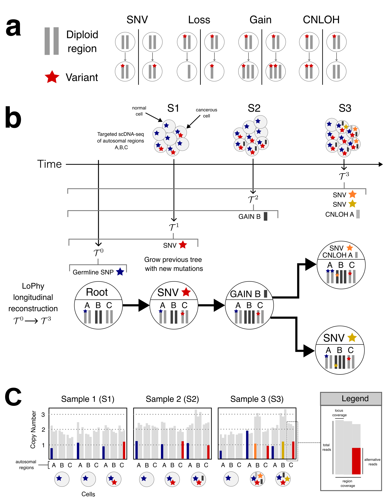

# LoPhy

**LoPhy** is an algorithm designed for **LO**ngitudinal **Phy**logenetic reconstruction from single-cell amplicon sequencing. The algorithmic design and experimental validation can be found here: https://www.biorxiv.org/content/10.1101/2025.09.16.676596v2.

<p align="center">
  
  <br>
  <em>Overview of LoPhy. <b>a.</b> Four types of somatic events are modeled. <b>b.</b> Longitudinal reconstruction: LoPhy
infers somatic events from longitudinal single-cell amplicon sequencing to build subtrees T<sup>1</sup>, T<sup>2</sup>, T<sup>3</sup> representing
evolution up to time of sampling. c. Inputs from longitudinal targeted single-cell sequencing include total coverage
of targeted regions and locus-level alternative/reference read counts.</em>
</p>

### Requirements

* MacOS or Linux
* \>= c++20 

### Installing
```
git clone https://github.com/ethanumn/LoPhy.git
cd LoPhy
mkdir bin
make
```


### Run on example data

Using this command will run LoPhy on the provided example data. Please see the jupyter-notebook in the `example` folder for an example of how to run LoPhy in python.
```
./bin/LoPhy -c example/inputs/character_matrix.csv -v example/inputs/variant_reads.csv -t example/inputs/total_reads.csv -m example/inputs/meta.csv -r example/inputs/region_reads.csv -o example/outputs -p out -seed 0 -homp 15 -hetp 4 -fp 0.02 -fn 0.05 -s example/inputs/cell_samples.txt
```
